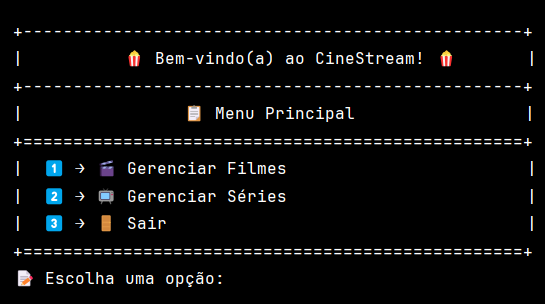
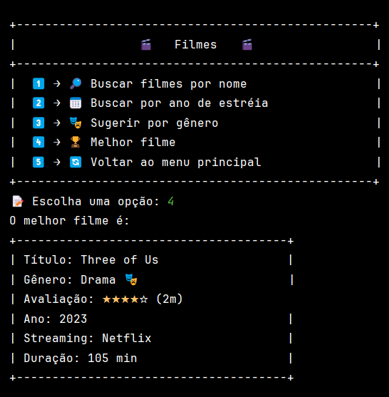

# CineStream 🎬

CineStream é um projeto inovador que utiliza um arquivo CSV contendo informações detalhadas sobre filmes e séries para extrair e manipular dados. Este projeto foi criado para facilitar a busca e análise de dados de filmes e séries, oferecendo uma interface de usuário simples e intuitiva.

## Descrição do Projeto 📜

O CineStream permite ao usuário:
- Buscar filmes e séries por nome
- Filtrar filmes e séries por ano de lançamento
- Sugerir filmes e séries por gênero
- Exibir a melhor avaliação de filmes e séries
- Visualizar informações detalhadas sobre filmes e séries

## Desafios Enfrentados 💪

1. **Manipulação de Dados CSV**: A leitura e manipulação de dados a partir de um arquivo CSV apresentou desafios, principalmente em garantir a precisão dos dados e lidar com formatações inconsistentes.
2. **Gerenciamento de Exceções**: Tratamento adequado de exceções para garantir que o programa lidasse graciosamente com entradas inválidas e dados mal formatados.
3. **Paginação de Resultados**: Implementar uma navegação paginada eficiente para grandes listas de filmes e séries.
4. **Integração de Bibliotecas**: Uso eficaz de bibliotecas como OpenCSV para manipulação de arquivos CSV.

## Conceitos Utilizados 📚
O projeto CineStream utiliza diversos conceitos avançados de programação para garantir eficiência e flexibilidade. Aqui estão alguns dos principais:

### Interfaces Funcionais
Utilizamos interfaces funcionais para definir contratos que são implementados por classes específicas, permitindo que diferentes tipos de dados sejam processados de forma uniforme. Um exemplo é a interface CarregarDados, que define métodos para carregar dados de arquivos CSV.
### Expressões Lambda
As expressões lambda simplificam a sintaxe para implementar métodos de interfaces funcionais, tornando o código mais conciso e legível. Exemplo:
```java
@Override 
public List<Serie> buscarSeriePorNome(String nome) {
    return series.stream()
            .filter(serie -> serie.getNome()
                    .toLowerCase().startsWith(nome.toLowerCase()))
            .collect(Collectors.toList());
}
```

### Streams API
A API de Streams do Java permite processar coleções de forma declarativa e funcional, utilizando métodos como filter, map, reduce e collect para manipular dados de maneira eficiente. Por exemplo:

```java

@Override
public List<Filme> buscarFilmesPorAno(int ano) {
    return filmes.stream()
            .filter(filme -> filme.getAno() == ano)
            .collect(Collectors.toList());
}
```
### Generics
Generics foram utilizados para criar métodos e classes que podem operar com diferentes tipos de dados sem duplicação de código. Isso é evidente na interface CarregarDados, que utiliza generics para definir métodos que podem carregar dados de filmes e séries.
```java
public interface CarregarDados<T> {
    List<T> carregarDadosDoArquivo();
}

```

### Tratamento de Exceções
O tratamento de exceções é crucial para lidar com dados ausentes ou mal formatados no arquivo CSV. O projeto inclui mecanismos para capturar e tratar exceções, garantindo que o programa continue funcionando mesmo quando ocorrem erros inesperados.

### Estrutura do Projeto 📂
`database`: Contém classes responsáveis pela leitura e manipulação de dados CSV. Como as classes
CarregarDadosFilmesImpl e CarregarDadosSeriesImpl

`model`: Define as classes de modelo para Filmes e Séries.

`service`: Contém a lógica de negócio para manipulação de filmes e séries.

`util`: Inclui utilitários para formatação e exibição de informações.

`view`: Contém a identidade visual do projeto, com os layouts do menu exibido para o usuário e a formatação da exibição do conteúdo estilizada.

### View do Projeto 📱


## Conclusão 🔚
O CineStream é um projeto robusto que demonstra como manipular grandes volumes de dados de forma eficiente e organizada, utilizando as mais avançadas técnicas de programação em Java. Os conceitos de interfaces funcionais, lambdas, streams, generics e tratamento de exceções são aplicados para criar uma aplicação flexível e fácil de manter.

Esperamos que o CineStream seja útil e inspire outros desenvolvedores a explorar e utilizar essas técnicas em seus próprios projetos. Se tiver alguma dúvida ou sugestão, sinta-se à vontade para entrar em contato!
### Realizadores do Projeto 💡
- [`Priscila Santos`](https://github.com/Priscila-Santos)
- [`Lucas Alecsander`](https://github.com/LucasAlec)
- [`Lucas Salvador do Carmo`](https://github.com/lucksc2805)
